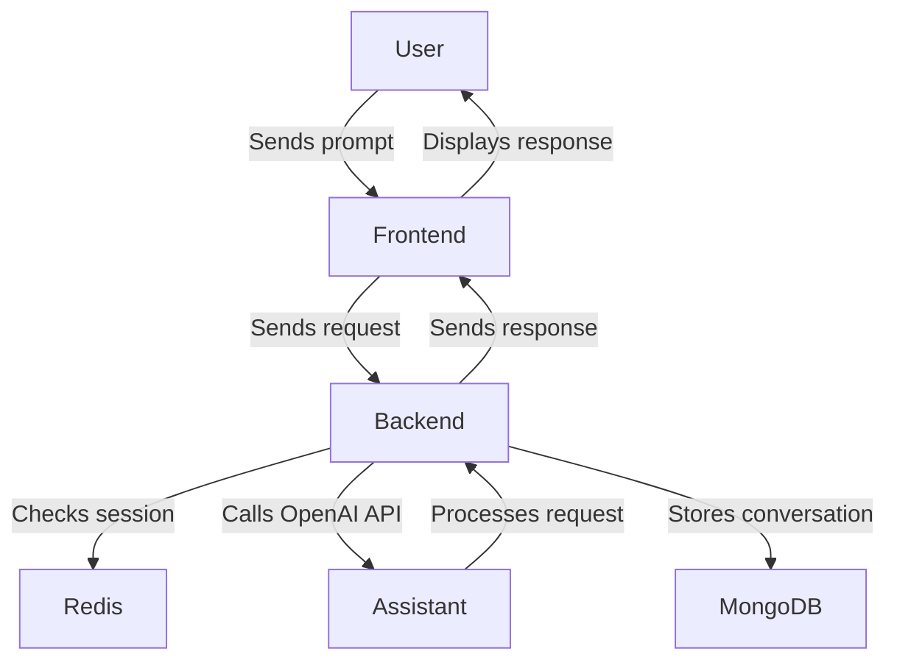
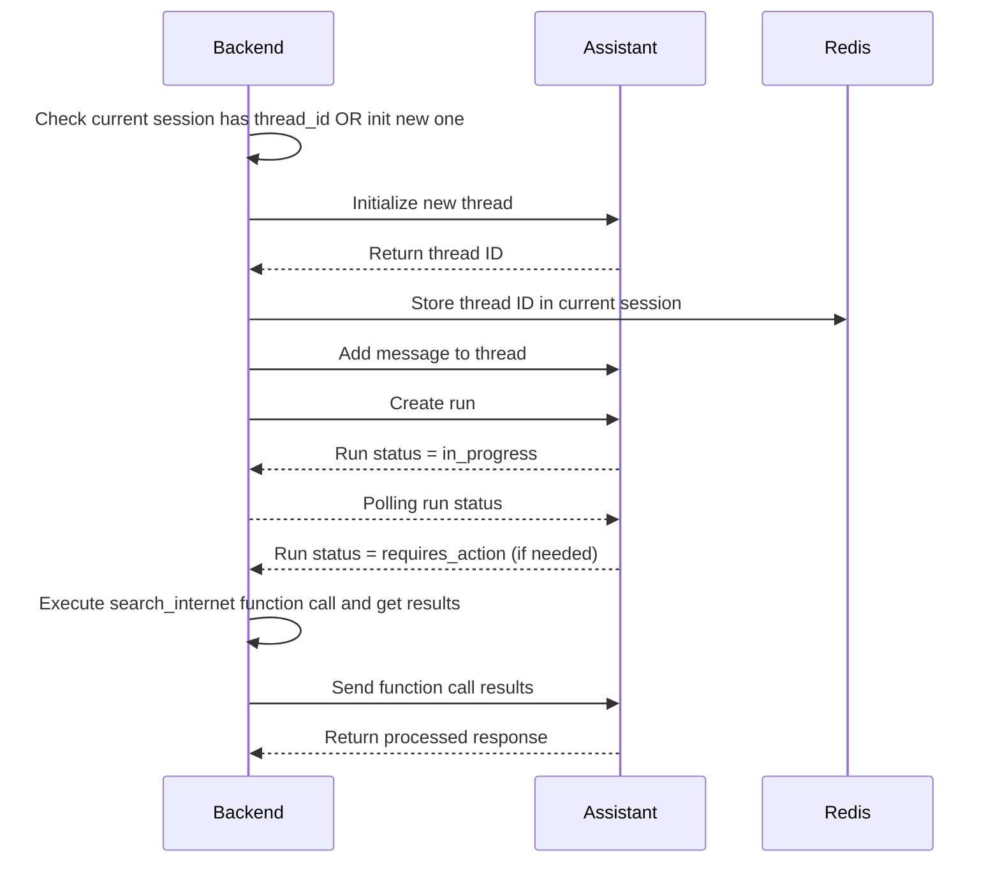
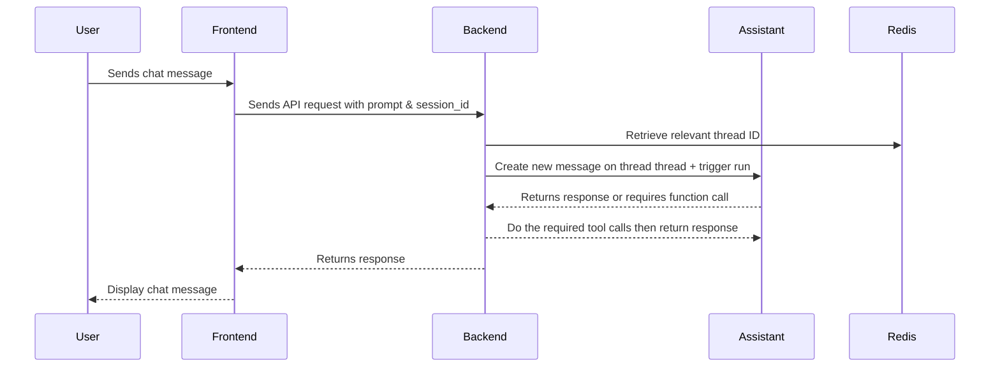

# Chatbot Application using Assistant API

## Index
1. [Description](#description)
2. [Architecture](#architecture)
3. [Assistant API Workflow](#assistant-api-workflow)
4. [System Components Request Flow](#system-components-request-flow)
5. [Technologies Used](#technologies-used)
6. [Configuration](#configuration)
7. [Local Installation Using Docker Compose](#local-installation-using-docker-compose)
8. [Stopping the Application](#stopping-the-application)
9. [Deployment](#deployment)
10. [Enhancements](#enhancements)

## Description
This project is a chatbot application utilizing the assistant feature provided by OpenAI using either **OpenAI's platform** ([docs](https://platform.openai.com/docs/assistants/overview)) or **Azure OpenAI** ([docs](https://learn.microsoft.com/en-us/azure/ai-services/openai/how-to/assistant)). The chatbot uses the Assistant API with **function calling** capabilities to enable basic chat functionality. If the bot cannot answer a user’s query, it searches the internet for relevant information.

## Architecture
The application consists of the following components:
- **Application Server**: Flask API using Python
- **Frontend**: React.js with Material UI
- **Session Management**: Redis
- **Chat Logging**: MongoDB


## Assistant API Workflow
This section outlines the interaction workflow between the Assistant API and the application service, detailing how the application server manages remote function calls through the Assistant API.



## System Components Request Flow



## Technologies Used
- Python (Flask)
- React.js (Material UI)
- Redis (Session Management)
- MongoDB (Chat Logging)
- OpenAI Assistant API
- Google Search API

## Configuration
Set up your environment variables in `.env`:

```ini
AZURE_OPENAI_ENDPOINT="" # Required for Azure OpenAI driver
AZURE_OPENAI_API_KEY="" # Required for Azure OpenAI driver
OPENAI_ASSISTANT_ID=""
OPENAI_API_KEY="" # Required for OpenAI driver
GOOGLE_SEARCH_API_KEY=""
GOOGLE_SEARCH_CX=""
```

This ensures that the chatbot retains context for each user session.

## Local Installation Using Docker Compose

To run this chatbot application locally, follow these steps:

1. Install [Docker](https://www.docker.com/) and [Docker Compose](https://docs.docker.com/compose/install/).
2. Clone the repository and navigate to the project root.
3. Create a `.env` file by copying the `.env.example` and configure it with the necessary environment variables. 
4. Run the following command to start all services:
   
   ```sh
   docker compose up --build
   ```

This will start all necessary services defined in the `docker-compose.yaml` file.

### Services in Docker Compose

The `docker-compose.yaml` file includes the following services:

- **API Server (`api-server`)**: 
  - Runs the Flask-based chatbot backend.
  - Mounts backend code for live updates.
  - Exposes port `5000`.
  - Connects to MongoDB and Redis.

- **Frontend (`front-app`)**: 
  - Runs the React.js front-end application.
  - Exposes port `3000`.

- **MongoDB (`mongo`)**: 
  - Provides persistent storage for chat logs.
  - Exposes port `27017`.
  - Uses a named volume for data persistence.

- **Mongo Express (`mongo-admin`)**: 
  - Web-based admin interface for MongoDB.
  - Exposes port `8081`.
  - Depends on the MongoDB service.

- **Redis (`redis`)**: 
  - Caches session-based chat history.
  - Exposes port `6379`.
  - Uses a named volume for data persistence.

- **Redis Insight (`redis-insight`)**: 
  - Web-based GUI tool for Redis management.
  - Exposes port `5540`.
  - Depends on Redis.

### Stopping the Application

To stop all running containers, use:

```sh
docker-compose down
```

This will shut down all services and remove associated containers.


## Deployment
will add it later

## Enhancements
will add it later
